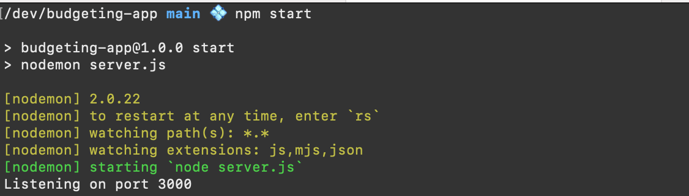

# budgeting-app

This is a small project to help people improve their technical, collaboration and soft skills. 

## Getting started

After forking/cloning this repository, cd into the directory and run:

`npm install`

Create a `.env` file in the same diretory as `.env.development.local`

Copy the contents `.env.development.local` and add your own variables.

Example, this will set a `localhost` port of `3000` and the datafile will be `data.sqlite3`:


```
PORT=3000
DB_SOURCE=/data.sqlite3
```

Initialize the `test` database with the command:

```
npm run db:init
```

Start the project with `npm start`.

Open the project in your browser with `localhost:3000` (or whatever the `PORT` number you chose in your `.env` file).

Success looks like:




- Go to localhost:3000 to see the homepage
- Go to localhost:3000/test to check if the database is seeded and connected.

### Prerequisits

In order to participate in this project you must

### Have Node.js installed

[Download LTS version here](https://nodejs.org/en)

### Be comfortable with command line basics

- Change directories
- Use git on the command line
- Be able to install and start a node application


## MVP

The current minimum viable product is:
 - An express app with a SQLite databse that uses server side rednering to
    - Have a home page with log in
    - Have a log in/log out system
    - Have users with some information like email, name, password
    - Transactions  
        - merchant (Nordstrom, CVS, Costco, etc.)
        - date
        - amount
        - category (groceries, transporation, medical etc. )
        - payment method (debit credit)

All of this information will be manually entered by a user. There will be no attempts to synchonize with a bank or credit card system. 

> **Note**: There should be a banner stating that this is a hobby level app and no user should enter sensitive information like actual bank account numbers. 


### Ideas beyond MVP

Once MVP is achieved, some possible directions include:
- Users can see financial health 
    - Show bank accounts and totals
    - Show debt and totals
- Users can set financial goals 
    - How much to save
    - How much debt to pay down


## Technologies

- CSS
- HTML (with EJS/server-side rendering)
- JavaScript
    - Express
- SQLite 